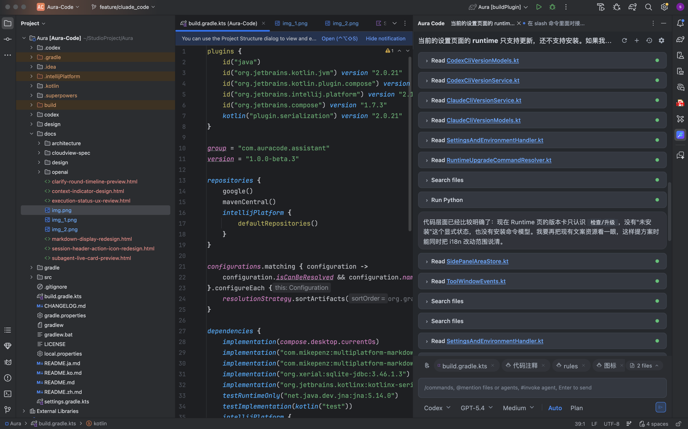
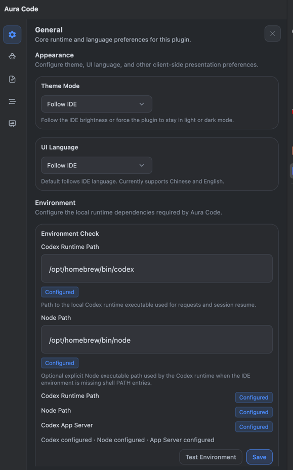

# Aura Code

[English](README.md) | [中文](README.zh.md) | [日本語](README.ja.md) | [한국어](README.ko.md)

Aura Code は、ローカル Codex ランタイムを IDE に直接統合する IntelliJ IDEA プラグインです。チャット、計画、承認、Diff レビュー、ローカルツール連携をプロジェクト単位のワークフローへまとめ、ターミナル、ブラウザ、エディタを行き来する負担を減らします。




## できること

- IntelliJ IDEA 内でネイティブに動作する `Aura Code` ツールウィンドウ
- プロジェクト単位のチャットセッションをローカル保存し、リモート会話の再開にも対応
- バックグラウンド実行を意識したマルチタブのセッションワークフロー
- ストリーミング応答、手動停止、履歴のページング再読み込み
- コンポーザーで `@` ファイル参照、添付、`#` 保存済み Agent、`/` スラッシュコマンドを利用可能
- Plan モード、Approval モード、ツール入力、実行中プランのフィードバック
- 変更ファイルを会話単位で集約し、Diff 表示、オープン、反映、巻き戻しを提供
- ローカル `stdio` とリモート streamable HTTP に対応した MCP サーバー管理
- ローカル Skills の検出、インポート、有効化 / 無効化、Slash 公開、アンインストール
- IntelliJ Problems ビューから `Ask Aura` でビルドエラーを直接引き渡し
- 非フォーカス中のセッション完了時に IDE 通知で知らせる
- 会話の Markdown エクスポート
- 中国語 / 英語 / 日本語 / 韓国語 UI と、ライト / ダーク / IDE追従テーマ

## 現在のプロダクト形状

Aura Code は現在 IntelliJ IDEA を対象とし、ローカルにインストールされた Codex を前提に動作します。プラグインは Codex app-server フローを中心に構築されており、プロジェクトローカルな状態を保持しつつ、ランタイムが対応していればリモート会話履歴のページング読み込みと再開も行えます。

現在のコードベースには、すでに次の基盤があります。

- Compose ベースのツールウィンドウ UI
- SQLite によるプロジェクトローカルなセッションリポジトリ
- `codex` と `node` のランタイム環境検出
- プラン、承認、ツール呼び出し、ファイル変更、ユーザー入力を扱う構造化イベント解析
- ランタイム、Saved Agents、Skills、MCP、テーマ、言語、通知の設定ページ

## 要件

- IntelliJ IDEA とローカル Codex ランタイムを実行できる macOS / Linux / Windows
- JDK 17
- `sinceBuild = 233` に互換のある IntelliJ IDEA
- `PATH` 上にあるローカル `codex` 実行ファイル、または `Settings -> Aura Code` での明示設定
- Codex app-server が必要とする場合のローカル `node` 実行ファイル

## ローカル利用向けインストール

1. プラグイン ZIP をビルドします。

```bash
./gradlew buildPlugin
```

2. 生成物は `build/distributions/` にあります。
3. IntelliJ IDEA で `Settings -> Plugins -> Install Plugin from Disk...` を開きます。
4. 生成された ZIP を選択します。
5. `Settings -> Aura Code` を開き、`Codex Runtime Path` と必要に応じて `Node Path` を確認します。

## 開発実行

プラグインを読み込んだサンドボックス IDE を起動します。

```bash
./gradlew runIde
```

開発中によく使うコマンド:

```bash
./gradlew test
./gradlew buildPlugin
./gradlew verifyPlugin
```

## 使い方

1. `View -> Tool Windows -> Aura Code` を開きます。
2. 初回起動時はランタイム設定を確認します。
3. コンポーザーにタスクを入力して送信します。
4. `@` でコンテキストファイルを追加し、ファイル / 画像を添付し、`#` で保存済み Agent を選び、`/plan`、`/auto`、`/new` などの Slash Command を使えます。
5. ツールウィンドウ内でタイムライン、承認、プラン確認、ツール入力プロンプト、編集ファイル Diff を確認します。
6. 必要に応じて履歴から過去セッションを再開したり、会話を Markdown としてエクスポートしたりできます。

## 主要ワークフロー

### チャットとセッション

- セッションはプロジェクト単位で分離され、SQLite にローカル保存されます
- ツールウィンドウは複数のセッションタブをサポートします
- タブを切り替えてもバックグラウンドのセッションは実行を継続できます
- 非フォーカス状態で完了したセッションは IntelliJ 通知を出せます

### 計画と実行制御

- コンポーザーで `Auto` と `Approval` の両実行モードを選べます
- `Plan` モードではプラン生成、修正依頼、直接実行が可能です
- 構造化されたツール入力プロンプトにより、IDE 内で実行を一時停止して回答を集められます

### コンテキストとファイル変更

- 自動コンテキストはアクティブエディタのファイルと選択テキストを追従します
- 手動ファイルコンテキスト、ファイル mention、添付をサポートします
- 変更ファイルはチャット単位で集約され、Diff / オープン / 巻き戻しアクションを提供します

### Skills と MCP

- 標準ローカルフォルダからローカル Skills を検出できます
- Skills はインポート、有効化、無効化、オープン、場所確認、アンインストールが可能です
- MCP サーバーは JSON 管理、サーバーごとの有効化、更新、認証、テストに対応します
- `stdio` と streamable HTTP の両トランスポートをサポートします

### ビルドエラー解析

- IntelliJ Problems ビューに `Ask Aura` アクションがあります
- 選択したビルド / コンパイルエラーを、ファイルと位置情報付きで Aura Code へ直接送れます

## プロジェクト構造

```text
src/main/kotlin/com/auracode/assistant/
  actions/         クイックオープンやビルドエラー引き渡しなどの IntelliJ アクション
  provider/        Codex provider、app-server ブリッジ、エンジン統合
  service/         チャット / セッション編成とランタイムサービス
  persistence/     SQLite ベースのローカルセッション保存
  toolwindow/      コンポーザー、タイムライン、設定、履歴、承認の Compose UI
  settings/        永続設定、Skills、MCP、保存済み Agents
  protocol/        統一イベントモデルとパーサー層
  integration/     ビルドエラー取得など IDE 連携フロー
src/test/kotlin/com/auracode/assistant/
  ...              サービス、プロトコル解析、UI ストア、各種フローの単体テスト
```

## デバッグメモ

プラグインが Codex と通信できない場合:

- `codex` が実行可能であることを確認
- 設定している場合は `node` も実行可能であることを確認
- `Settings -> Aura Code -> Test Environment` を使用
- `Help -> Show Log in Finder/Explorer` から IDE ログを確認

履歴や再開が正しく見えない場合:

- ランタイムがプラグイン外で認証済みであることを確認
- 同じセッションを再開していることを確認
- リモート会話履歴の読み込みとローカルセッション保存を個別に確認

## オープンソース状況

- 現在のリポジトリは主に IntelliJ IDEA サポートに注力しています
- ローカル ZIP インストールに対応しています
- Marketplace 署名と公開フローはまだこのリポジトリに接続されていません

## ライセンス

Aura Code は Apache License 2.0 の下で公開されています。完全なライセンス本文はプロジェクトルートの `LICENSE` ファイルを参照してください。
